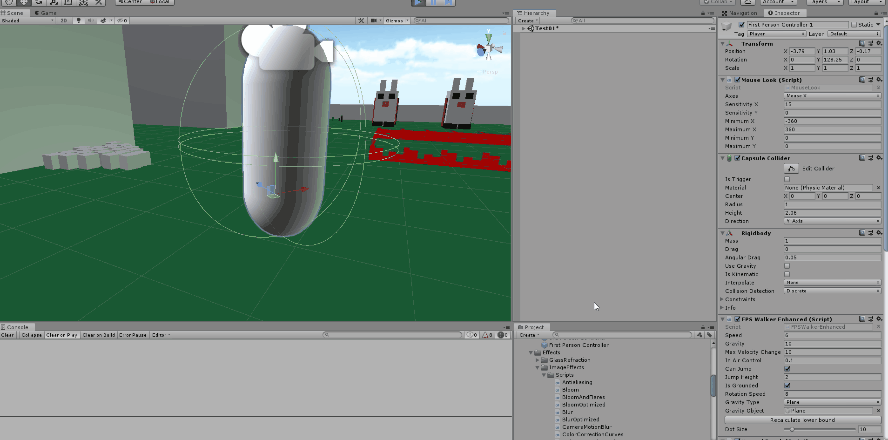
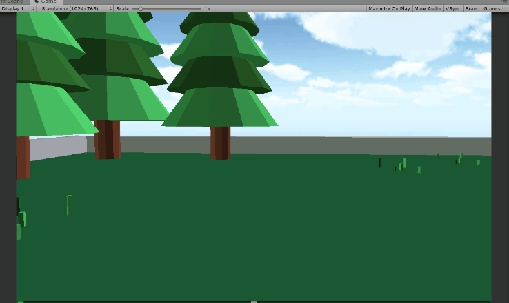
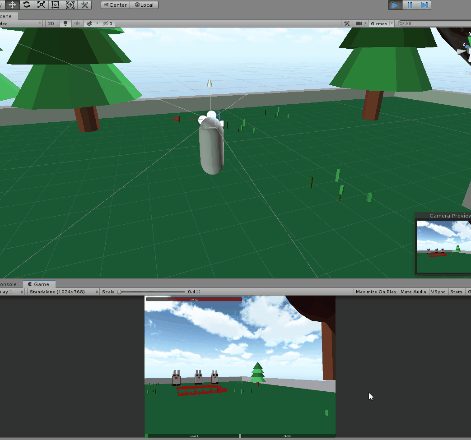
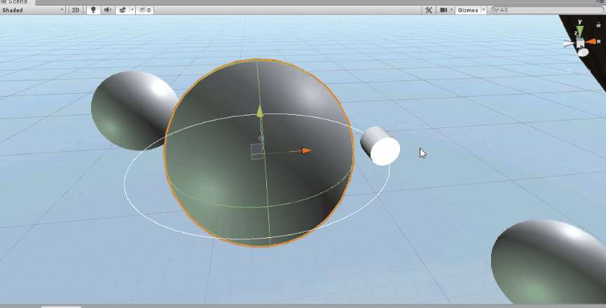

# Unity-scripts-example
Some of my work with unity scripts

Mikael Poetsch

# Basic flying follower and Bat controller
Control a flying enemy moving towards the player all the way up to the last point it has seen the player then walks back the same path walked all the way back to it's origin point

# Border detector
Creates a button to detect the lower point of a object, at it's "feet", to determine wether or not an object is grounded to the floor in a non-plane surface

# Camera shake
Script that makes the camera shake through script

# Character controller physics
Script to update the gravity correctly to any object affected by gravity of a "planet" according to it's relative rotation

# FPSWalkerEnhanced
Script to make a FPS walker for the character on non-plane surfaces

# GameCreator
Script that takes a image file and uses the pixels collor to create a pac-man map

# HitLine
Class that cast a raypoint into a direction and return either the first object it hits or all object it hits in a given direction

# NormalPunch
Class that controls normal attack for the player. A object that represent a arm punching is instantiated randomly on the player vision and causes damage to a enemy that is aiming at.

# PlanetDataEditor
Class to show the planet gravity range and force through a wire disc handler

